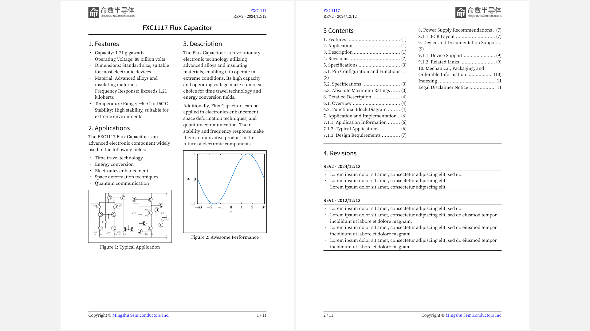

# tids: A TI-Style Datasheet Template for Typst

English | [简体中文](README.zh_cn.md)

This project is a easy to use Typst electronic component datasheet template purposed 
for testing and showcasing the potential of using Typst for technical documentation writing.



**If this project is helpful to you, please consider leaving a star.**

## Disclaimer

This is an open-source project created solely for demonstration purposes, with no intention of infringing on any trademarks. The author is not affiliated with TI in any way.

## Features

- **Simple and User-friendly:** Uses Markdown format for easy readability and writing.
- **Customizable:** Can be customized for specific component specifications.

## Getting Started

0. Install Typst if you don't have:
    ```powershell
    winget install --id Typst.Typst
    ```
1. Clone this repository locally:
   ```bash
   git clone https://github.com/oldrev/tids.git
   ```
3. Build the PDF example:
    ```bash
    typst compile demo-ds.typ
    ```
4. Check the generated [`demo-ds.pdf`](demo-ds.pdf) out.

## Usage

1. Copy the template file `tsds.typ` to the directory of your project.
2. Import the template and call `tids()` function:
    ```typst
    #import "tids.typ": tids, ds_tablex_styles

    #show: doc => tids(ds_metadata: (
            title: [YourDSTitle],
            product: [YourProductName],
            product_url: "https://github.com/oldrev/tids",
            revision: [CurrentRevision],
            publish_date: [PublishedOn]
        ),
        features: [features for the title page],
        applications: [application information for the title page],
        desc: [description content for the title page],
        rev_list: [revision list],
        doc: doc
    )
    // ... The content of your document
    ```
    See [`demo-ds.typ`](demo-ds.typ) for details.


## Demo Videos:

- Youtube: TODO

## Contributions

Feel free to contribute and raise issues. Please see the Contribution Guidelines for more information.

## License

This project is licensed under the Apache 2.0 License.